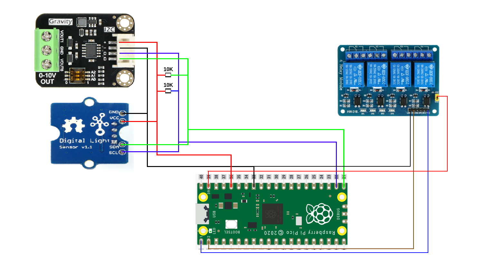

This package contains usage of sensor [TSL2561](https://wiki.seeedstudio.com/Grove-Digital_Light_Sensor/) and DAC converter[DFRobot DFR0971 ](https://wiki.dfrobot.com/SKU_DFR0971_2_Channel_I2C_0_10V_DAC_Module) to control power of LED lamp.

